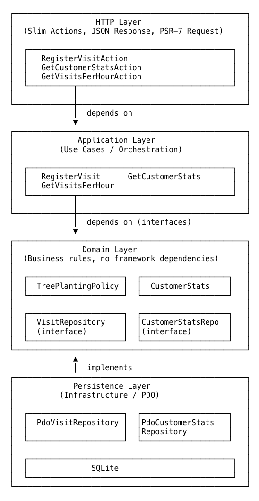

# Tree Nation Project - X Visits = 1 Tree
---

The system receives visit events from a physical device, associates those visits with customers, tracks each customer's latest connection time, and converts visits into planted trees according to a configurable rule:

```txt
X visits = 1 tree
```

It also exposes a simple frontend (react) dashboard showing visits aggregated by hour.

The implementation is intentionally small and pragmatic. The goal is build a distributed platform, and demonstrate clear backend structure, explicit business rules, a simple API, testable application logic, and understandable technical decisions.

---

## Technical Approach

This project uses a lightweight DDD/hexagonal architecture with **[PHP/Slim](https://www.slimframework.com/)**. 

Instead, the implementation focuses on:

* a clear domain boundary,
* framework-independent business logic,
* explicit use cases,
* simple persistence,
* a small HTTP API with **PHP/Slim**,
* a minimal frontend with **React**,
* easy local execution.
* a container defination for docker.

The main business capability is named `TreePlanting` and business goal is to convert customer activity into tree planting impact.

### Technical Decisions

* Use lightweight DDD/hexagonal architecture allows that the business logic is separated from HTTP, frameworks and persistence. This keeps the domain testable and makes infrastructure replaceable without overengineering the project.
* Keep [TreePlantingPolicy](https://github.com/AFelipeTrujillo/tree-nation-assessment/blob/master/src/TreePlanting/Domain/TreePlantingPolicy.php) as an explicit domain object. The rule `X visits = 1 tree` is the central business rule.
* SQLite keeps the project easy to run. Also, it provides real persistence without requiring Docker or a database server
* Add simple idempotency through `eventId`. Supporting an optional `eventId` prevents duplicate device events from incrementing customer stats more than once. (See [VisitRepository](https://github.com/AFelipeTrujillo/tree-nation-assessment/blob/master/src/TreePlanting/Domain/VisitRepository.php))

## Architecture
The backend follows a lightweight hexagonal structure: 
  
```txt
src/
  TreePlanting/
    Domain/
    Application/
    Infrastructure/
public/
	index.php 	<-- entry point  
```



### Domain Layer ([Link](https://github.com/AFelipeTrujillo/tree-nation-assessment/tree/master/src/TreePlanting/Domain))
The Domain Layer contains the main business concepts, rules, and contracts of the application. It represents the core of the system and should not depend on frameworks, databases, HTTP requests, or external services.

- **TreePlantingPolicy**: Defines the business rule used to calculate trees.
- **CustomerStats**: Represents customer-related statistics
- **VisitRepository**: Defines the contract for storing and retrieving data.
- **CustomerStatsRepository**: The contract for retrieving customer statistics
- **VisitAnalyticsRepository**: The contract for analytics queries related to visits

### Application ([Link](https://github.com/AFelipeTrujillo/tree-nation-assessment/tree/master/src/TreePlanting/Application))

The Application Layer contains the use cases of the system. A use case represents an action that the application can perform, such as registering a visit or getting customer statistics.

- **RegisterVisit**: Coordinates the process of registering a new visit.
- **GetCustomerStats**: Coordinates the process of retrieving statistics for a customer.
- **GetVisitsPerHour**: Coordinates the process of retrieving visit grouped by hour.

### Infrastructure ([Link](https://github.com/AFelipeTrujillo/tree-nation-assessment/tree/master/src/TreePlanting/Infrastructure))

The Infrastructure Layer contains the technical adapters of the application. These adapters connect the application core with external technologies such as the HTTP framework, the database, and request/response handling.

- **HTTP actions/controllers**: Manage HTTP requests / response and required data
- **PDO repository implementations**: Implement the repository interfaces using PDO and contain the SQL queries.
- **SQLite connection setup**: Configures the database connection used by the persistence adapters.
- **Request/response handling**: Converts incoming requests into input data for the application.

## Technology Choices

### SlimPHP

SlimPHP is used as a small HTTP microframework. It is lightweight but flexible enough to provide clean routing, dependency injection, clear request handling, and gradual scaling as the application grows. It also supports middleware, making it easy to add authentication and other cross-cutting features in the future.

SlimPHP is considered an infrastructure detail. The business logic, written in pure PHP, does not depend on SlimPHP. This keeps the core of the application independent from the HTTP framework and makes it easier to replace SlimPHP in the future if the organization or development team decides to use a different framework.

### PDO

PDO is used for persistence access.

For this scope, using an ORM would add unnecessary abstraction. The required queries are simple, and PDO keeps the data access layer explicit, easy to review, fast, and secure when prepared statements are used.

The application still depends on repository interfaces, not directly on PDO. This keeps persistence as an infrastructure detail and allows the implementation to be changed in the future without affecting the business logic.

### SQLite

SQLite is used as the persistence layer to keep the project easy to run locally and to support integration testing.

It avoids the need for a database server, while still providing real persistence, SQL constraints, indexes, and query-based hourly aggregation.

The architecture allows SQLite to be replaced with PostgreSQL later by changing only the infrastructure repository implementations and the SQL dialect where necessary. The business logic would not need to change.

### React

For this project, React is a good choice because the frontend needs to communicate with a backend API, display dynamic information, and update the UI when the user interacts with the application. React makes this easier by separating the UI into reusable components and by managing state in a simple and predictable way.

React is also lightweight and flexible enough to grow in the future. If the application becomes larger, new components, pages, forms, charts, or authentication flows can be added without changing the backend architecture.

## Database

This project uses a static SQL schema file instead of a full [migration](https://github.com/AFelipeTrujillo/tree-nation-assessment/blob/master/database/schema.sql) tool and [seeds](https://github.com/AFelipeTrujillo/tree-nation-assessment/blob/master/database/seeds.sql) file to provide sample data.

```bash
php bin/migrate.php
```

### Schema

```sql
CREATE TABLE IF NOT EXISTS visits (
    id INTEGER PRIMARY KEY AUTOINCREMENT,
    event_id TEXT UNIQUE,
    customer_id TEXT NOT NULL,
    shop_id TEXT NOT NULL,
    occurred_at TEXT NOT NULL,
    received_at TEXT NOT NULL
);

CREATE INDEX IF NOT EXISTS idx_visits_customer_id
ON visits (customer_id);

CREATE INDEX IF NOT EXISTS idx_visits_occurred_at
ON visits (occurred_at);

CREATE TABLE IF NOT EXISTS customer_stats (
    customer_id TEXT PRIMARY KEY,
    total_visits INTEGER NOT NULL DEFAULT 0,
    trees_planted INTEGER NOT NULL DEFAULT 0,
    last_connection_at TEXT,
    created_at TEXT NOT NULL,
    updated_at TEXT NOT NULL
);
```

## How to Run

### Run with docker

```bash
docker-compose up
```

Example `.env`:

```env
APP_ENV=dev
DATABASE_PATH=var/app.sqlite
VISITS_PER_TREE=5
```

Go to:  
```
http://localhost:8080
```

### Docker Entry Point ([Link](https://github.com/AFelipeTrujillo/tree-nation-assessment/blob/master/docker/entrypoint.sh))
Install dependecies and run [migrations](https://github.com/AFelipeTrujillo/tree-nation-assessment/blob/master/bin/migrate.php).

```bash
#!/usr/bin/env sh

set -e

cd /app

mkdir -p var

if [ ! -f .env ]; then
  cp .env.example .env
fi

composer install \
  --no-interaction \
  --prefer-dist \
  --no-progress

php bin/migrate.php

exec php -S 0.0.0.0:8080 -t public
```

## Example API Usage

### Register a visit

```bash
curl -X POST http://localhost:8080/api/visits \
  -H "Content-Type: application/json" \
  -d '{
    "eventId": "device-event-abc-123",
    "customerId": "cus_123",
    "shopId": "shop_001",
    "occurredAt": "2026-05-29T10:15:00Z"
  }'
```

### Get customer stats

```bash
curl http://localhost:8080/api/customers/cus_123/stats
```

### Get visits per hour

```bash
curl http://localhost:8080/api/analytics/visits-per-hour
```

## Run tests with:

```bash
vendor/bin/phpunit
```

[Unit Test](https://github.com/AFelipeTrujillo/tree-nation-assessment/tree/master/tests/Unit).  
[Integration Test](https://github.com/AFelipeTrujillo/tree-nation-assessment/tree/master/tests/Integration). 

Thanks for readng :) 
