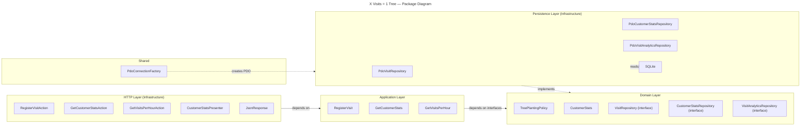

# Tree Nation Project - X Visits = 1 Tree
---

The system receives visit events from a physical device, associates those visits with customers, tracks each customer's latest connection time, and converts visits into planted trees according to a configurable rule:

```txt
X visits = 1 tree
```

It also exposes a simple frontend (react) dashboard showing visits aggregated by hour.

The implementation is intentionally small and pragmatic. The goal is build a distributed platform, and demonstrate clear backend structure, explicit business rules, a simple API, testable application logic, and understandable technical decisions.

---

## Technical Approach

This project uses a lightweight hexagonal and DDD architecture with **[PHP/Slim](https://www.slimframework.com/)**. 

Instead, the implementation focuses on:

* a clear domain boundary,
* framework-independent business logic,
* explicit use cases,
* simple persistence,
* a small HTTP API with **PHP/Slim**,
* a minimal frontend with **ReactJS**,
* easy local execution.
* a container defination for docker.

The main business capability is named `TreePlanting` and business goal is to convert customer activity into tree planting impact.

## Architecture




